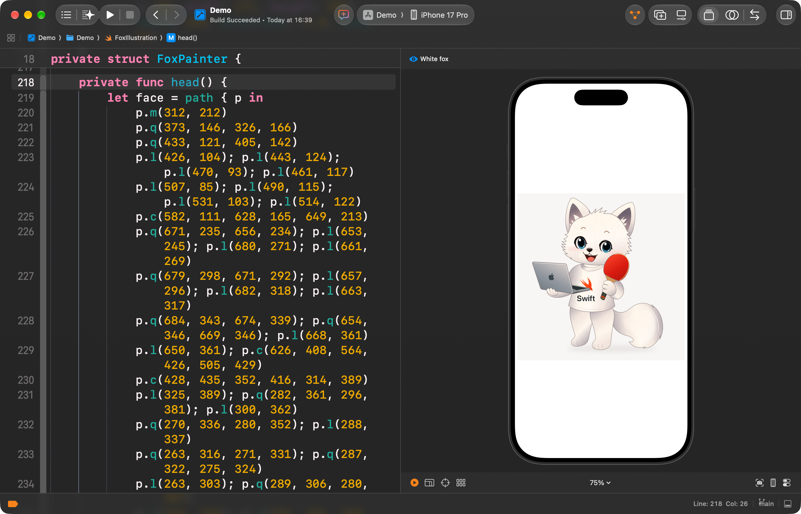

<a id="english"></a>

# 🦊 FoxPainter

[](https://www.swift.org/)
[](https://developer.apple.com/xcode/swiftui/)
[](https://developer.apple.com/ios/)
[](#requirements)

🌐 **English** · [繁體中文](#traditional-chinese)

FoxPainter is a cheerful white fox drawn entirely with SwiftUI. The illustration combines Bézier paths, gradients, shadows, deterministic fur strokes, SF Symbols, and a resolution-independent `Canvas`—with no embedded character artwork.



## ✨ Highlights

- 🎨 Pure SwiftUI vector drawing in a 1,000 × 1,000 design space
- 🦊 Layered face, ears, paws, tail, clothing, laptop, and table-tennis paddle
- 🖌️ Gradients, soft shadows, highlights, blush, and procedural fur texture
- 📐 Responsive scaling for portrait and landscape layouts
- ♿ A descriptive accessibility label for VoiceOver
- 📦 No third-party dependencies

<a id="requirements"></a>

## 🧰 Requirements

- Xcode 27 or later
- iOS 27 or later
- Swift 5

## 🚀 Run the project

1. Clone the repository.
2. Open `Demo.xcodeproj` in Xcode.
3. Select an iPhone simulator.
4. Build and run, or open the SwiftUI preview in `FoxIllustration.swift`.

```bash
git clone https://github.com/PeterPanSwift/FoxPainter.git
cd FoxPainter
open Demo.xcodeproj
```

## 🧩 Structure

- `Demo/FoxIllustration.swift` — the reusable vector illustration and drawing code
- `Demo/ContentView.swift` — the responsive screen that presents the fox
- `Demo/DemoApp.swift` — the application entry point

## 💡 Use the illustration

`FoxIllustration` behaves like any other SwiftUI view:

```swift
FoxIllustration()
    .aspectRatio(1, contentMode: .fit)
    .padding()
```

---

<a id="traditional-chinese"></a>

# 🦊 FoxPainter（繁體中文）

[](https://www.swift.org/)
[](https://developer.apple.com/xcode/swiftui/)
[](https://developer.apple.com/ios/)
[](#需求)

🌐 [English](#english) · **繁體中文**

FoxPainter 是一隻完全使用 SwiftUI 繪製的可愛白狐。插畫結合貝茲曲線、漸層、陰影、固定規則產生的毛髮筆觸、SF Symbols 與不受解析度限制的 `Canvas`，沒有嵌入狐狸角色圖片。


## ✨ 特色

- 🎨 使用 1,000 × 1,000 設計座標繪製的純 SwiftUI 向量插畫
- 🦊 分層繪製臉部、耳朵、手腳、尾巴、上衣、筆電與桌球拍
- 🖌️ 包含漸層、柔和陰影、高光、腮紅及程序化毛髮紋理
- 📐 自動配合直向與橫向畫面等比例縮放
- ♿ 提供 VoiceOver 可讀的描述標籤
- 📦 不使用第三方套件

<a id="需求"></a>

## 🧰 需求

- Xcode 27 或更新版本
- iOS 27 或更新版本
- Swift 5

## 🚀 執行專案

1. Clone 此 repository。
2. 使用 Xcode 開啟 `Demo.xcodeproj`。
3. 選擇 iPhone 模擬器。
4. Build and Run，或在 `FoxIllustration.swift` 開啟 SwiftUI Preview。

```bash
git clone https://github.com/PeterPanSwift/FoxPainter.git
cd FoxPainter
open Demo.xcodeproj
```

## 🧩 專案結構

- `Demo/FoxIllustration.swift` — 可重用的向量插畫與繪圖程式
- `Demo/ContentView.swift` — 顯示狐狸並配合畫面縮放的主畫面
- `Demo/DemoApp.swift` — App 進入點

## 💡 使用插畫

`FoxIllustration` 可以和其他 SwiftUI View 一樣直接使用：

```swift
FoxIllustration()
    .aspectRatio(1, contentMode: .fit)
    .padding()
```

[⬆️ Back to English / 回到英文](#english)
